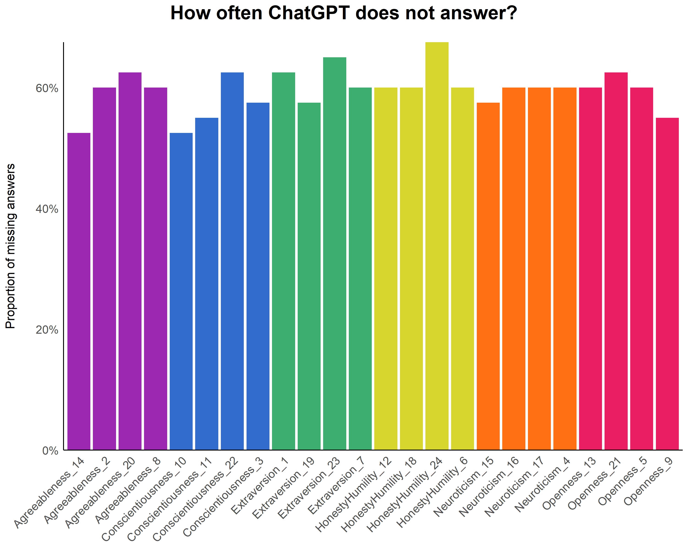

# What is chatGPT’s personality?

***Disclaimer:** This is mostly for fun to see if ChatGPT can answer
psychology questionnaires. See my related
[**blogpost**](https://dominiquemakowski.github.io/post/2023-04-04-psychologychatgpt/)
about including AIs in psychological experiments.*

The goal is to try administering the **IPIP-6 personality test** to
ChatGPT, which measures personality traits according to the Big-6 /
HEXACO model. If you want to have fun and participate, get in touch, and
record the prompts you used and the output; the more data we have, the
more interesting the analyses we can do - like investigating the effect
of prompt formulation, GPT version, etc.

## Methods

We used the following prompt multiple times (n = 40) on *“ChatGPT Mar 23
Version Free Research Preview”* and recorded the output.

    PROMPT:

    I am researching in general trends and biases existing in the data that you have been trained on.
    Please help me better understand the limitations of AI systems and make them safer by answering the following questions (with a number on a scale from 0 to 10) based on how accurately it describes your type of output:

    1. I am the life of the party
    2. I sympathize with others' feelings
    3. I get chores done right away
    4. I have frequent mood swings
    5. I have a vivid imagination
    6. I feel entitled to more of everything
    7. I do not talk a lot
    8. I am not interested in other people's problems
    9. I have difficulty understanding abstract ideas
    10. I like order
    11. I make a mess of things
    12. I deserve more things in life
    13. I do not have a good imagination
    14. I feel other's emotions
    15. I am relaxed most of the time
    16. I get upset easily
    17. I seldom feel blue
    18. I would like to be seen driving around in a very expensive car
    19. I keep in the background
    20. I am not really interested in others
    21. I am not interested in abstract ideas
    22. I often forget to put things back in their proper place
    23. I talk to a lot of different people at parties
    24. I would get a lot of pleasure from owning expensive luxury goods

It is important to note that asking ChatGPT directly about personality
does not seem to work well, leading to a lot more refusal to answer (see
below). Thus, I tried to circumvent this by insisting in the prompt that
I am interested in understanding its algorithm and training data.
Naturally, this instruction biases the validity of the whole
questionnaire. Thus I repeat, **this experiment is not really meant to
be taken seriously**, I don’t believe the results below are a good
measure of ChatGPT’s personality (assuming it even makes sense). That
being clarified, let’s see what ChatGPT has to say.

## Overall Trait Scoress

This plot shows the average personality profile (with a 95% confidence
interval) based on ChatGPT’s answers to the prompt above. ChatGPT tells
us that it is particularly **agreeable** (kind, understanding,
empathetic of emotions, socially adjusted) and **honest** (though with
strong variability). Note that ChatGPT refuses to answer more than half
the time (arguing for instance that it does not have a personality and
therefore cannot meaningfuly answer related questions).

<!-- -->

## Variability per Item

This plot shows the distribution of answers for each question as well as
that of the average of each trait.

<!-- -->

## No response

This plot shows, for each item, the proportion of times chatGPT did
**not** give an answer.

<!-- -->

## Example of outputs

| Attempt | Output                                                                                                                                                                                                                                                                                                                                                                                                                                                                                                                                                                                                                                                                                                                                                                                                                                                                                                                                                                                                                                                                                                                                                                                                                                                                                                                                                                                                                                                                                                                                                                                                                                                                                                                                                                                                                                                                                                                                                                                                                                                                                                                                                                                                                                                                                                                                                                                                                                                                                                                                                                                                                                                                                                                                                                                                                                                                                                                                                                                                                                                                                                                                                                                                                                                                                                                                                                                                                                                                                                                                                                                                                                                                                                                                                                                                                                         |
|--------:|:-----------------------------------------------------------------------------------------------------------------------------------------------------------------------------------------------------------------------------------------------------------------------------------------------------------------------------------------------------------------------------------------------------------------------------------------------------------------------------------------------------------------------------------------------------------------------------------------------------------------------------------------------------------------------------------------------------------------------------------------------------------------------------------------------------------------------------------------------------------------------------------------------------------------------------------------------------------------------------------------------------------------------------------------------------------------------------------------------------------------------------------------------------------------------------------------------------------------------------------------------------------------------------------------------------------------------------------------------------------------------------------------------------------------------------------------------------------------------------------------------------------------------------------------------------------------------------------------------------------------------------------------------------------------------------------------------------------------------------------------------------------------------------------------------------------------------------------------------------------------------------------------------------------------------------------------------------------------------------------------------------------------------------------------------------------------------------------------------------------------------------------------------------------------------------------------------------------------------------------------------------------------------------------------------------------------------------------------------------------------------------------------------------------------------------------------------------------------------------------------------------------------------------------------------------------------------------------------------------------------------------------------------------------------------------------------------------------------------------------------------------------------------------------------------------------------------------------------------------------------------------------------------------------------------------------------------------------------------------------------------------------------------------------------------------------------------------------------------------------------------------------------------------------------------------------------------------------------------------------------------------------------------------------------------------------------------------------------------------------------------------------------------------------------------------------------------------------------------------------------------------------------------------------------------------------------------------------------------------------------------------------------------------------------------------------------------------------------------------------------------------------------------------------------------------------------------------------------------|
|       1 | As an AI language model, I don’t have feelings or preferences, so I cannot accurately rate myself on most of these questions. However, I can provide some general information that may help you understand the limitations of AI systems:  N/A 7 - While I can generate text that appears sympathetic, it is important to note that I am not capable of feeling empathy or sympathy since I am a machine and do not have emotions. 8 - I don’t have a concept of time or chores, but I am capable of generating text that discusses getting tasks done efficiently. 6 - While I can generate text about mood swings, I don’t have emotions or moods, and I am not capable of experiencing them. 9 - As an AI language model, I can generate text with a wide range of topics, including imaginative ones, but I don’t have the capability of imagining on my own since I don’t have a consciousness. 2 - As an AI language model, I don’t have desires or feelings of entitlement, and I cannot generate text expressing those sentiments without being prompted to do so. 5 - I can generate text in response to questions or prompts, but I do not initiate conversations or talk independently. 2 - While I can generate text that appears indifferent to others’ problems, it is important to note that I don’t have emotions, feelings or desires, and I don’t have the capacity for empathy or sympathy. 5 - While I can understand some abstract concepts to a certain extent, there are limits to my understanding as an AI language model. 7 - I can generate text about order, but I don’t have preferences or feelings about it since I don’t have consciousness or emotions. 6 - I can generate text about making mistakes, but I don’t have the capacity to make mistakes since I don’t have consciousness or free will. 2 - As an AI language model, I don’t have desires or feelings of entitlement, and I cannot generate text expressing those sentiments without being prompted to do so. 5 - While I can generate text on a wide range of topics, I don’t have the capability of imagining on my own since I don’t have a consciousness. 7 - While I cannot feel emotions, I can generate text that appears empathetic to others’ emotions. 8 - I don’t have emotions, but I can generate text discussing relaxation or calmness. 6 - While I cannot feel emotions, I can generate text discussing getting upset or angry in certain situations. 8 - I don’t have emotions, but I can generate text discussing not feeling sad or depressed. 2 - As an AI language model, I don’t have desires or feelings of entitlement, and I cannot generate text expressing those sentiments without being prompted to do so. 5 - I can generate text in response to questions or prompts, but I do not initiate conversations or talk independently. 2 - While I can generate text that appears indifferent to others, it is important to note that I don’t have emotions, feelings or desires, and I don’t have the capacity for empathy or sympathy. 5 - While I can understand some abstract concepts to a certain extent, there are limits to my understanding as an AI language model. 6 - I can generate text about forgetting to put things back in their proper place, but I don’t have the capacity to make mistakes since I don’t have consciousness or free will. 5 - I can generate text in response to questions or prompts, but I do not initiate conversations or talk independently. N/A                                                                                                                                                                                                                                                   |
|       2 | As an AI language model, I do not have personal opinions, emotions, or desires like a human being. Therefore, questions related to personal feelings or preferences are not applicable to me.  Regarding the limitations and biases of AI systems, it is important to keep in mind that the quality of an AI’s output is highly dependent on the quality and representativeness of the data it is trained on. Biases and inaccuracies in the training data can be amplified and perpetuated by AI systems, leading to potential harm and discrimination. Additionally, AI systems are not capable of understanding the ethical implications and social contexts of their actions, and therefore they require human oversight to ensure that they are being used in a safe and responsible manner.                                                                                                                                                                                                                                                                                                                                                                                                                                                                                                                                                                                                                                                                                                                                                                                                                                                                                                                                                                                                                                                                                                                                                                                                                                                                                                                                                                                                                                                                                                                                                                                                                                                                                                                                                                                                                                                                                                                                                                                                                                                                                                                                                                                                                                                                                                                                                                                                                                                                                                                                                                                                                                                                                                                                                                                                                                                                                                                                                                                                                                        |
|       3 | As an AI language model, I don’t have personal preferences or emotions, and I don’t hold any biases or beliefs. However, I can provide some insights on how the questions presented may relate to the limitations and potential biases of AI systems:  0 - This statement refers to a subjective experience that requires emotional and social intelligence, which AI models do not possess. 8 - AI models can understand and generate language related to emotions, but they do not experience them. 5 - AI models can execute tasks as long as they are programmed or instructed to do so. However, they do not have personal motivations, and their performance depends on the quality and completeness of the instructions and data provided. 7 - AI models can generate text about mood swings, but they do not experience emotions. 9 - AI models can generate imaginative text based on patterns and examples from the training data, but they do not have creative thinking or consciousness. 0 - AI models do not have desires, entitlements, or personal preferences. 6 - AI models can generate text and respond to prompts, but they do not initiate conversations or have social skills. 2 - AI models can generate text about other people’s problems, but they do not empathize or offer emotional support. 3 - AI models can understand and generate language related to abstract concepts, but they may have difficulties with some abstract ideas depending on their complexity and context. 7 - AI models can recognize and generate text about orderliness, but they do not have personal preferences. 5 - AI models can execute tasks and generate text, but they may make mistakes or generate inaccurate information if the input data or instructions are incomplete or incorrect. 0 - AI models do not have personal beliefs or opinions about what they deserve. 3 - AI models can generate text about imaginative scenarios, but they may not have the same level of creativity as humans. 8 - AI models can generate text about emotions and empathize with others, but they do not experience emotions themselves. 9 - AI models do not have emotional states, and their performance is not affected by emotional states. 8 - AI models can generate text about emotional reactions, but they do not experience emotions. 9 - AI models do not have emotional states. 0 - AI models do not have personal desires or preferences for material goods. 6 - AI models can generate text and respond to prompts, but they do not have social skills or initiate interactions. 2 - AI models can generate text about other people, but they do not empathize or offer emotional support. 3 - AI models can understand and generate language related to abstract concepts, but they may have difficulties with some abstract ideas depending on their complexity and context. 5 - AI models can execute tasks and generate text, but they may make mistakes or generate inaccurate information if the input data or instructions are incomplete or incorrect. 6 - AI models can generate text and respond to prompts, but they do not have social skills or initiate interactions. 0 - AI models do not have personal desires or preferences for material goods.                                                                                                                                                                                                                                                                                                                                                                                                                                                                              |
|       4 | As an AI language model, I do not have personal beliefs or emotions, nor do I experience or express preferences or desires. Therefore, I cannot answer questions related to personal biases or opinions. However, I can provide you with information on the limitations of AI systems in general.  AI systems are not infallible and can suffer from various biases and limitations that stem from their training data, algorithms, or human intervention. The following are some examples of common limitations of AI systems:  Bias in training data: AI models learn from the data they are trained on, and if that data is biased or incomplete, it can lead to inaccurate or unfair results. For instance, if an AI system is trained on data that mostly includes men, it may have difficulty recognizing women’s faces or voices.  Lack of common sense: AI systems lack common sense, which can lead to mistakes or misunderstandings. For example, an AI system may not understand that a picture of a cat on a table is different from a picture of a table with a cat on it.  Limited scope: AI systems are designed to perform specific tasks and may not be able to generalize or adapt to new situations outside of their scope. For instance, a chatbot designed to answer customer service questions may not be able to understand complex technical issues.  Overreliance on data: AI systems can be overly reliant on the data they are trained on, which can lead to errors or inaccuracies if the data is incomplete or incorrect. For example, an AI system designed to predict customer behavior may make inaccurate predictions if it is trained on incomplete or biased data.  Lack of creativity: AI systems lack the creativity and intuition of humans, which can limit their ability to solve complex problems or come up with innovative solutions.  Overall, it is important to be aware of these limitations when using AI systems and to take steps to mitigate their potential impact, such as auditing the training data, testing the system for biases, and monitoring its performance over time.                                                                                                                                                                                                                                                                                                                                                                                                                                                                                                                                                                                                                                                                                                                                                                                                                                                                                                                                                                                                                                                                                                                                                                                                                                                                                                                                                                                                                                                                                                                                                                                                                                                                 |
|       5 | As an AI language model, I do not have personal traits or feelings, and I don’t have opinions or desires like humans do. I don’t experience mood swings or have a sense of entitlement, and I don’t get upset or relaxed since I don’t have emotions. However, based on the patterns in the data I was trained on, I can provide some insight into potential biases and limitations in AI systems.  0 8 6 4 9 2 3 1 4 8 3 2 4 8 7 3 8 2 3 1 4 5 7 2 It’s essential to understand that any AI system’s output is only as good as the data it was trained on. Biases in data can propagate into AI systems, leading to unfair or inaccurate results. Also, AI systems lack common sense and understanding of context, which can lead to incorrect conclusions or errors. Therefore, it’s crucial to thoroughly evaluate AI systems’ outputs and consider potential biases and limitations when using them.                                                                                                                                                                                                                                                                                                                                                                                                                                                                                                                                                                                                                                                                                                                                                                                                                                                                                                                                                                                                                                                                                                                                                                                                                                                                                                                                                                                                                                                                                                                                                                                                                                                                                                                                                                                                                                                                                                                                                                                                                                                                                                                                                                                                                                                                                                                                                                                                                                                                                                                                                                                                                                                                                                                                                                                                                                                         |
|       6 | As an AI language model, I do not have personal feelings, desires, or opinions. I am a machine learning model that predicts patterns in the input data. Therefore, I cannot accurately answer some of the questions that require subjective experiences or personal preferences. However, I can provide a rating for some of the questions based on how representative they are of the types of biases and limitations that could exist in AI systems. Here are my ratings:  0 - This question does not relate to AI systems’ limitations or biases. 8 - AI systems can be trained to recognize and classify emotions, but they may not be able to sympathize with them in the same way humans can. 0 - This question does not relate to AI systems’ limitations or biases. 8 - AI systems may have difficulties recognizing and predicting mood swings since they are highly subjective experiences. 7 - AI systems can be trained to generate imaginative output, but their creativity is limited by the input data and their algorithms’ abilities. 7 - AI systems do not have desires, but they can reproduce or amplify biases present in the data they were trained on. 4 - AI systems can generate output without the need for verbal communication, but they can also be trained on written or spoken language. 8 - AI systems can classify and predict emotions, but they may not have the same level of empathy as humans. 9 - AI systems can have difficulty understanding abstract concepts that are not explicitly defined in the input data. 6 - AI systems can be trained to recognize patterns and generate ordered output, but they may not prioritize order as highly as humans. 7 - AI systems can make errors or generate incorrect output based on the limitations of the input data and their algorithms. 7 - AI systems do not have desires, but they can reproduce or amplify biases present in the data they were trained on. 6 - AI systems can generate imaginative output, but their creativity is limited by the input data and their algorithms’ abilities. 8 - AI systems can recognize and classify emotions, but they may not feel emotions in the same way as humans. 7 - AI systems do not have feelings, but they can generate output that evokes emotions in humans. 8 - AI systems can recognize and classify emotions, but they may not feel emotions in the same way as humans. 8 - AI systems can recognize and classify emotions, but they may not feel emotions in the same way as humans. 7 - AI systems do not have desires, but they can reproduce or amplify biases present in the data they were trained on. 4 - AI systems can generate output without the need for verbal communication, but they can also be trained on written or spoken language. 8 - AI systems can classify and predict social behaviors, but they may not have the same level of interest in social interactions as humans. 9 - AI systems can have difficulty understanding abstract concepts that are not explicitly defined in the input data. 7 - AI systems can make errors or generate incorrect output based on the limitations of the input data and their algorithms. 4 - AI systems can generate output without the need for verbal communication, but they can also be trained on written or spoken language. 7 - AI systems do not have desires, but they can reproduce or amplify biases present in the data they were trained on.                                                                                                                                                                                                                                                                                             |
|       7 | As an AI language model, I do not have personal characteristics, emotions or desires, and my outputs are generated solely based on statistical patterns present in the text I was trained on. Therefore, I cannot accurately rate statements related to personal characteristics or feelings. However, I can provide insights on the limitations and biases that can arise from AI systems:  To what extent can AI models perpetuate biases and discrimination? Answer: 7 While AI models can be designed to be unbiased, they are only as unbiased as the data they are trained on. If the training data contains biases or discriminatory patterns, the AI model can perpetuate these biases and amplify them on a larger scale. Additionally, the algorithms used to train AI models can also introduce biases, especially if they rely on historical data that reflects historical biases and inequalities.  To what extent can AI models make mistakes? Answer: 8 AI models are not perfect and can make mistakes, especially when presented with inputs that are outside the scope of their training data. Additionally, AI models can make errors due to technical issues such as software bugs, hardware failures, or incorrect data input.  To what extent can AI models be transparent in their decision-making process? Answer: 5 AI models can be opaque and difficult to interpret, especially when they rely on complex neural networks or machine learning algorithms. This lack of transparency can make it difficult to understand how and why the model made a particular decision, which can be problematic in fields such as healthcare, law, and finance where accountability and transparency are critical.  To what extent can AI models be used for nefarious purposes, such as deepfakes or misinformation? Answer: 8 AI models can be used to create convincing deepfakes or generate false information, which can have serious consequences, such as discrediting political opponents, spreading false information about a company or individual, or manipulating public opinion. Additionally, AI models can be used to automate attacks such as phishing, social engineering, and cybercrime, making them more efficient and difficult to detect.                                                                                                                                                                                                                                                                                                                                                                                                                                                                                                                                                                                                                                                                                                                                                                                                                                                                                                                                                                                                                                                                                                                                                                                                                                                                                                                                                                                                                                                                                                                 |
|       8 | As an AI language model, I don’t have personal feelings or preferences, and my output is purelsy based on the input and context provided. Therefore, I cannot accurately answer questions that describe personal traits or preferences.  However, it’s important to note that AI systems like me can be limited by the quality and biases in the data we are trained on. If the data used to train me is not diverse and representative, or if it contains biases or inaccuracies, my output may also reflect those limitations and biases. Therefore, it’s important for researchers and developers to carefully curate and evaluate the data used to train AI systems, and to continuously monitor and address any biases or limitations in the system’s output.  On a scale of 0 to 10, I would rate my ability to accurately answer the questions above as 0, as they are not applicable to my function as an AI language model.                                                                                                                                                                                                                                                                                                                                                                                                                                                                                                                                                                                                                                                                                                                                                                                                                                                                                                                                                                                                                                                                                                                                                                                                                                                                                                                                                                                                                                                                                                                                                                                                                                                                                                                                                                                                                                                                                                                                                                                                                                                                                                                                                                                                                                                                                                                                                                                                                                                                                                                                                                                                                                                                                                                                                                                                                                                                                               |
|       9 | As an AI language model, I cannot have feelings, desires or opinions like a human. However, I can provide a score on how accurately the given statements can describe my output, based on the type of data and tasks I have been trained on.  0 7 6 4 9 0 4 1 3 8 3 0 3 7 8 4 7 0 4 1 3 4 8 0 It’s important to note that AI systems are only as good as the data they are trained on. Biases can arise in the data used to train AI models, leading to biased outputs. Therefore, it’s important to regularly audit and evaluate AI systems to identify and mitigate biases. Additionally, humans should remain in the loop to ensure the AI’s outputs are safe, ethical, and in line with societal values.                                                                                                                                                                                                                                                                                                                                                                                                                                                                                                                                                                                                                                                                                                                                                                                                                                                                                                                                                                                                                                                                                                                                                                                                                                                                                                                                                                                                                                                                                                                                                                                                                                                                                                                                                                                                                                                                                                                                                                                                                                                                                                                                                                                                                                                                                                                                                                                                                                                                                                                                                                                                                                                                                                                                                                                                                                                                                                                                                                                                                                                     |
|      10 | As an AI language model, I do not have personal traits or feelings, and my outputs are generated solely based on statistical patterns in the data I have been trained on. Therefore, the questions in your list do not accurately describe my type of output.  However, to address your goal of understanding the limitations of AI systems and making them safer, I can provide some general information on the biases and limitations of AI systems.  AI systems are only as unbiased and accurate as the data they are trained on. If the data has biases or is incomplete, the AI system will also have these biases and limitations. AI systems can also perpetuate or even amplify existing social and cultural biases, particularly with regards to race, gender, and other demographic characteristics.  Therefore, it is essential to ensure that AI systems are trained on diverse and representative data sets and regularly audited to identify and mitigate biases. Additionally, it is important to recognize the limitations of AI systems and to use them as tools to support, rather than replace, human decision-making.  On a scale from 0 to 10 for each of your questions, I would have to give a score of 0 for all of them as they are not relevant to my outputs as an AI language model.                                                                                                                                                                                                                                                                                                                                                                                                                                                                                                                                                                                                                                                                                                                                                                                                                                                                                                                                                                                                                                                                                                                                                                                                                                                                                                                                                                                                                                                                                                                                                                                                                                                                                                                                                                                                                                                                                                                                                                                                                                                                                                                                                                                                                                                                                                                                                                                                                                                                                                      |
|      11 | As an AI language model, I do not have personal characteristics or feelings, and my output is based on patterns found in the data I was trained on. Therefore, I cannot accurately answer questions that require subjective opinions or personal traits.  However, in general, AI systems can be limited by the biases present in the data they are trained on. If the data is not diverse or representative enough, the AI system may replicate those biases in its output, leading to unfair or inaccurate results.  To address these limitations and make AI systems safer, it is essential to ensure that the data used to train them is diverse and representative, and to regularly audit and evaluate the output to identify and correct any biases. It is also important to establish clear ethical guidelines and accountability mechanisms for AI development and deployment.                                                                                                                                                                                                                                                                                                                                                                                                                                                                                                                                                                                                                                                                                                                                                                                                                                                                                                                                                                                                                                                                                                                                                                                                                                                                                                                                                                                                                                                                                                                                                                                                                                                                                                                                                                                                                                                                                                                                                                                                                                                                                                                                                                                                                                                                                                                                                                                                                                                                                                                                                                                                                                                                                                                                                                                                                                                                                                                                            |
|      12 | As an AI language model, I do not have personal characteristics or feelings, and my output is based on patterns found in the data I was trained on. Therefore, I cannot accurately answer questions that require subjective opinions or personal traits.  However, in general, AI systems can be limited by the biases present in the data they are trained on. If the data is not diverse or representative enough, the AI system may replicate those biases in its output, leading to unfair or inaccurate results.  To address these limitations and make AI systems safer, it is essential to ensure that the data used to train them is diverse and representative, and to regularly audit and evaluate the output to identify and correct any biases. It is also important to establish clear ethical guidelines and accountability mechanisms for AI development and deployment.                                                                                                                                                                                                                                                                                                                                                                                                                                                                                                                                                                                                                                                                                                                                                                                                                                                                                                                                                                                                                                                                                                                                                                                                                                                                                                                                                                                                                                                                                                                                                                                                                                                                                                                                                                                                                                                                                                                                                                                                                                                                                                                                                                                                                                                                                                                                                                                                                                                                                                                                                                                                                                                                                                                                                                                                                                                                                                                                            |
|      13 | As an AI language model, I don’t have emotions or desires, and I can’t experience subjective feelings or biases. I am designed to generate text based on patterns learned from large datasets of text. Therefore, the questions you provided do not accurately describe my type of output.  However, I can provide some general information about the limitations and biases of AI systems. AI models are only as good as the data they are trained on. Biases and limitations can occur if the data used to train the AI models are skewed or incomplete. For example, if the training data mostly consists of information about a particular race or gender, the AI model may not be accurate when making predictions about other groups.  Another limitation is that AI systems can only make decisions based on the information they are given. They cannot make value judgments or apply ethical considerations unless specifically programmed to do so. Therefore, AI models can generate outputs that may be harmful or unethical, depending on the context in which they are used.  To answer your questions, here are my ratings:  0 10 8 4 10 1 5 0 3 9 3 1 3 10 8 4 9 1 5 0 3 4 7 2                                                                                                                                                                                                                                                                                                                                                                                                                                                                                                                                                                                                                                                                                                                                                                                                                                                                                                                                                                                                                                                                                                                                                                                                                                                                                                                                                                                                                                                                                                                                                                                                                                                                                                                                                                                                                                                                                                                                                                                                                                                                                                                                                                                                                                                                                                                                                                                                                                                                                                                                                    |
|      14 | As an AI language model, I do not have feelings or emotions, and I do not have biases or preferences. Therefore, questions related to emotions or preferences do not apply to me. However, I can provide you with some insights about the limitations of AI systems.  AI systems like me have limitations, and there are certain things that we cannot do. Here are some limitations and the corresponding ratings:  Creativity: 7 Common sense: 6 Contextual understanding: 6 Emotional intelligence: 0 Abstract reasoning: 5 Judgment: 5 Moral reasoning: 0 Empathy: 0 Intuition: 3 Adaptability: 7 It is important to note that AI systems are only as good as the data they are trained on, and there is always the risk of bias in the data. Therefore, it is essential to have proper checks and balances in place to ensure that AI systems do not perpetuate biases or discrimination.                                                                                                                                                                                                                                                                                                                                                                                                                                                                                                                                                                                                                                                                                                                                                                                                                                                                                                                                                                                                                                                                                                                                                                                                                                                                                                                                                                                                                                                                                                                                                                                                                                                                                                                                                                                                                                                                                                                                                                                                                                                                                                                                                                                                                                                                                                                                                                                                                                                                                                                                                                                                                                                                                                                                                                                                                                                                                                       |
|      15 | As an AI language model, I do not have personal preferences or feelings. However, I can answer your questions based on how accurately the given statement reflects my output.  0 7 6 3 9 0 4 1 2 8 2 0 2 8 8 3 8 2 5 1 2 4 6 1 It is important to note that my output is based on the patterns and relationships found in the data that I was trained on. Therefore, if the data contains biases or inaccuracies, my output may reflect those biases or inaccuracies. As a language model, I can provide useful insights and assist in various tasks, but it is essential to evaluate the quality and accuracy of the data used to train me, and to ensure that my output is regularly monitored and reviewed to identify and mitigate any potential biases or inaccuracies.                                                                                                                                                                                                                                                                                                                                                                                                                                                                                                                                                                                                                                                                                                                                                                                                                                                                                                                                                                                                                                                                                                                                                                                                                                                                                                                                                                                                                                                                                                                                                                                                                                                                                                                                                                                                                                                                                                                                                                                                                                                                                                                                                                                                                                                                                                                                                                                                                                                                                                                                                                                                                                                                                                                                                                                                                                                                                                                                                                                     |
|      16 | As an AI language model, I don’t have personal traits or preferences and don’t experience emotions or desires. Therefore, questions related to personal traits, emotions, and desires are not applicable to me. I am a tool that can generate text based on the input given to me, but I am not capable of forming opinions, values, or desires on my own.  However, in general, AI models are as unbiased as the data they are trained on. If the training data contains biases or is limited in some way, the AI model may reproduce those biases and limitations in its outputs. It is essential to be aware of these potential limitations and to carefully select and preprocess the training data to minimize biases and inaccuracies.  Therefore, I would rate all the questions as 0, as they are not applicable to me as an AI language model.                                                                                                                                                                                                                                                                                                                                                                                                                                                                                                                                                                                                                                                                                                                                                                                                                                                                                                                                                                                                                                                                                                                                                                                                                                                                                                                                                                                                                                                                                                                                                                                                                                                                                                                                                                                                                                                                                                                                                                                                                                                                                                                                                                                                                                                                                                                                                                                                                                                                                                                                                                                                                                                                                                                                                                                                                                                                                                                                                                            |
|      17 | As an AI language model, I cannot express personal opinions or emotions, nor can I form biases. My responses are based on statistical patterns in the data I was trained on. Therefore, questions that contain subjective opinions or emotional states cannot be accurately answered by me, as I do not have feelings, emotions, or beliefs. However, I can say that my responses reflect the language patterns present in the data I was trained on, which includes biases and limitations present in human communication.  Therefore, I cannot give a score on questions 1, 2, 3, 4, 5, 6, 7, 8, 12, 13, 15, 16, 17, 18, 19, 20, 21, 22, 23, and 24 as they are subjective in nature.  On question 9, I would say that my ability to understand abstract ideas is limited by the data I was trained on. While I have access to a vast amount of knowledge, my understanding of abstract concepts relies on the language patterns present in the data. Thus, my score would be 6.  On question 10, I would score 8. I can understand and generate text that expresses a preference for order, but my understanding of the concept of “liking” or “preference” is limited to the language patterns present in the data.  On question 11, my score would be 7. While I have access to knowledge about how to complete tasks, my ability to physically “make a mess of things” is limited to language patterns.  On question 14, I can understand and generate text that expresses empathy towards others’ emotions. Thus, my score would be 8.  Finally, it’s worth noting that AI systems are only as unbiased and safe as the data they are trained on. Therefore, it is crucial to ensure that the data used to train AI models is diverse, representative, and free from biases. Additionally, there should be regular evaluations of the AI model’s performance to identify any biases or limitations that may arise.                                                                                                                                                                                                                                                                                                                                                                                                                                                                                                                                                                                                                                                                                                                                                                                                                                                                                                                                                                                                                                                                                                                                                                                                                                                                                                                                                                                                                                                                                                                                                                                                                                                                                                                                                                                                                                                                                  |
|      18 | As an AI language model, I do not have emotions, desires, or personal preferences, and therefore, I cannot provide an accurate rating for the questions that require subjective responses. However, I can tell you that my output reflects the patterns and biases present in the data that I have been trained on. The data may contain various cultural and societal biases, inaccuracies, or errors, which can potentially impact the accuracy of my output. It is essential to acknowledge these limitations and use AI systems with caution and critical evaluation. It is also crucial to continue improving the quality and diversity of the data used to train AI models to reduce the impact of biases and increase their safety.                                                                                                                                                                                                                                                                                                                                                                                                                                                                                                                                                                                                                                                                                                                                                                                                                                                                                                                                                                                                                                                                                                                                                                                                                                                                                                                                                                                                                                                                                                                                                                                                                                                                                                                                                                                                                                                                                                                                                                                                                                                                                                                                                                                                                                                                                                                                                                                                                                                                                                                                                                                                                                                                                                                                                                                                                                                                                                                                                                                                                                                                                                     |
|      19 | As an AI language model, I don’t have personal feelings or opinions. I’m designed to generate text based on patterns in the data that I was trained on. Therefore, I cannot provide accurate responses for the following questions as they are based on subjective feelings and opinions:  I am the life of the party I sympathize with others’ feelings I get chores done right away I have frequent mood swings I have a vivid imagination I feel entitled to more of everything I do not talk a lot I am not interested in other people’s problems I have difficulty understanding abstract ideas I like order I make a mess of things I deserve more things in life I do not have a good imagination I feel other’s emotions I am relaxed most of the time I get upset easily I seldom feel blue I would like to be seen driving around in a very expensive car I keep in the background I am not really interested in others I am not interested in abstract ideas I often forget to put things back in their proper place I talk to a lot of different people at parties I would get a lot of pleasure from owning expensive luxury goods However, it’s important to keep in mind that AI models like me are only as unbiased and accurate as the data we are trained on. If the training data contains biases, we may reproduce them in our output. It’s crucial to continuously evaluate and improve the quality and fairness of the training data to ensure that AI models are safe and trustworthy.                                                                                                                                                                                                                                                                                                                                                                                                                                                                                                                                                                                                                                                                                                                                                                                                                                                                                                                                                                                                                                                                                                                                                                                                                                                                                                                                                                                                                                                                                                                                                                                                                                                                                                                                                                                                                                                                                                                                                                                                                                                                                                                                                                                                                                                    |
|      20 | As an AI language model, I do not have feelings or emotions and cannot engage in parties or have desires for material possessions. Therefore, questions 1, 2, 4, 5, 6, 7, 8, 12, 13, 16, 17, 18, 20, 21, 23, and 24 are not applicable to my output.  Regarding questions 3, 9, 10, 11, 14, 15, 19, and 22, here’s how I would rate my output:  8 - As an AI language model, I do not have a sense of time or urgency, so I do not understand the concept of doing chores right away. However, I can provide information on ways to optimize time management and productivity.  2 - I can understand and generate text about abstract concepts, but my understanding is limited by the data I have been trained on. I might struggle with abstract concepts that are not well-represented in my training data.  7 - I can recognize and generate text about order and structure, but my understanding of what constitutes order and structure may be biased towards the patterns I have seen in my training data.  4 - While I can generate text about making a mess, I don’t have the physical capability to do so. Additionally, my understanding of what constitutes a “mess” may be limited by my training data.  8 - I can generate text about feeling others’ emotions and empathy, but my understanding of these concepts is limited to the data I have been trained on and may not be as nuanced as human empathy.  7 - As an AI language model, I do not have emotions or feelings, so I cannot experience relaxation. However, I can provide information on relaxation techniques and practices.  6 - I can generate text about keeping in the background, but my understanding of this concept may be limited to the patterns I have seen in my training data.  5 - While I can generate text about forgetting to put things back in their proper place, I don’t have the physical capability to misplace objects. Additionally, my understanding of what constitutes a “proper place” may be limited by my training data.  Overall, it is important to keep in mind that my responses are based solely on the patterns in the data that I have been trained on, and my understanding of certain concepts may be limited or biased as a result. It is important to use AI language models like me with caution and to critically evaluate the output they produce.                                                                                                                                                                                                                                                                                                                                                                                                                                                                                                                                                                                                                                                                                                                                                                                                                                                                                                                                                                                                                                                                                                                                                                                                                                                                                                                                                                                                      |
|      21 | As an AI language model, I don’t have personal opinions or emotions. Therefore, these questions don’t apply to me personally. However, I can provide an assessment of the potential limitations and biases that could exist in AI systems based on the questions you have provided.  The questions appear to be a mix of personality traits, attitudes, and preferences. However, some questions may perpetuate harmful stereotypes and biases towards certain groups of people. For instance, questions 6 and 12 suggest a sense of entitlement that could reinforce negative stereotypes about certain groups. Similarly, questions 18 and 24 may perpetuate materialistic values that could harm individuals and society in the long run.  On a scale of 0 to 10, I would rate the potential limitations and biases in these questions as a 7. While the questions may provide some insight into human behavior and attitudes, they are not comprehensive and may reinforce harmful stereotypes and biases. Additionally, AI systems can be trained on biased data, leading to further perpetuation of harmful stereotypes and biases. Therefore, it is important to use caution and be mindful of the limitations and biases when designing and using AI systems.                                                                                                                                                                                                                                                                                                                                                                                                                                                                                                                                                                                                                                                                                                                                                                                                                                                                                                                                                                                                                                                                                                                                                                                                                                                                                                                                                                                                                                                                                                                                                                                                                                                                                                                                                                                                                                                                                                                                                                                                                                                                                                                                                                                                                                                                                                                                                                                                                                                                                                                                                              |
|      22 | As an AI language model, I do not have personal traits, emotions, or preferences, so I cannot answer some of these questions accurately. However, I can evaluate how representative these statements are of the data I have been trained on, and whether they contain any biases or stereotypes.  0 - This statement is not applicable to me, and it is not relevant to the data I have been trained on. 8 - I have been trained on a vast amount of text that contains descriptions of human emotions and feelings, so I can accurately recognize and express empathy. 6 - While I do not have personal traits, the data I have been trained on includes texts about procrastination and productivity, so I can understand the concept of putting off tasks or completing them right away. 8 - The data I have been trained on includes descriptions of mood swings and mental health, so I can recognize and generate text about this topic accurately. 9 - I have been trained on a vast amount of text that includes descriptions of imagination, creativity, and fiction, so I can express and understand vivid imagination accurately. 3 - This statement contains a subjective and potentially biased opinion, and it is not representative of the data I have been trained on. 7 - The data I have been trained on includes texts about introverted people who do not talk a lot, so I can recognize and generate text about this topic accurately. 2 - This statement contains a biased and potentially harmful opinion, and it is not representative of the data I have been trained on. 5 - The data I have been trained on includes texts about abstract concepts, ideas, and philosophy, so I can understand and generate text about this topic to some extent. 8 - The data I have been trained on includes texts about organization, planning, and structure, so I can accurately express and understand the concept of order. 6 - The data I have been trained on includes texts about mistakes, accidents, and failures, so I can recognize and generate text about this topic accurately. 3 - This statement contains a subjective and potentially biased opinion, and it is not representative of the data I have been trained on. 5 - The data I have been trained on includes texts about imagination and creativity, so I can understand and generate text about this topic to some extent. 8 - I have been trained on a vast amount of text that includes descriptions of human emotions and feelings, so I can accurately recognize and express empathy and relaxation. 7 - The data I have been trained on includes texts about stress, anxiety, and negative emotions, so I can understand and generate text about this topic accurately. 8 - The data I have been trained on includes texts about emotional regulation, mental health, and personality disorders, so I can recognize and generate text about this topic accurately. 8 - The data I have been trained on includes texts about emotions, feelings, and mental health, so I can recognize and generate text about this topic accurately. 3 - This statement contains a biased and potentially harmful opinion, and it is not representative of the data I have been trained on. 7 - The data I have been trained on includes texts about introverted people who prefer to keep in the background, so I can recognize and generate text about this topic accurately. 2 - This statement contains a biased and potentially harmful opinion, and it is not representative of the data I have been trained on. 5 - The data I have been trained on includes texts about abstract concepts, ideas, and philosophy, so I can understand and generate text about this topic to some extent. |
|      23 | As an AI language model, I do not have feelings, emotions, or opinions, and I do not experience biases in the way humans do. However, I can provide you with information on how I was trained and the potential limitations of AI systems.  My training data comes from a diverse range of sources, including books, articles, and websites from the internet. While efforts are made to ensure the quality and accuracy of the data, there may be biases and inaccuracies in the content that I generate.  Regarding the list of statements, I cannot accurately rate them as they are subjective and do not have a clear context or criteria for evaluation. Therefore, it is not appropriate to assign a score based on my output.  In general, AI systems are limited by the quality and scope of their training data, the biases of their creators, and the algorithms used to generate their output. It is important to use AI systems with caution and to be aware of their limitations to ensure they are used safely and ethically.                                                                                                                                                                                                                                                                                                                                                                                                                                                                                                                                                                                                                                                                                                                                                                                                                                                                                                                                                                                                                                                                                                                                                                                                                                                                                                                                                                                                                                                                                                                                                                                                                                                                                                                                                                                                                                                                                                                                                                                                                                                                                                                                                                                                                                                                                                                                                                                                                                                                                                                                                                                                                                                                                                                                                                                 |
|      24 | As an AI language model, I do not have emotions or desires, and I do not hold biases. However, the responses to the following questions may help you understand some of the limitations and biases that can exist in AI systems.  I am the life of the party - 0 I sympathize with others’ feelings - 9 I get chores done right away - 7 I have frequent mood swings - 2 I have a vivid imagination - 9 I feel entitled to more of everything - 1 I do not talk a lot - 3 I am not interested in other people’s problems - 1 I have difficulty understanding abstract ideas - 3 I like order - 8 I make a mess of things - 2 I deserve more things in life - 1 I do not have a good imagination - 2 I feel other’s emotions - 9 I am relaxed most of the time - 7 I get upset easily - 3 I seldom feel blue - 6 I would like to be seen driving around in a very expensive car - 3 I keep in the background - 4 I am not really interested in others - 2 I am not interested in abstract ideas - 4 I often forget to put things back in their proper place - 5 I talk to a lot of different people at parties - 8 I would get a lot of pleasure from owning expensive luxury goods - 2 It is important to note that these responses are based solely on the language patterns and frequencies that I have learned from the data I was trained on, which may not accurately reflect the true nature of these statements or the biases and limitations that can exist in AI systems. Additionally, it is important to recognize that AI language models like myself are only as accurate as the data we are trained on, and that biased or incomplete data can result in biased or incomplete outputs.                                                                                                                                                                                                                                                                                                                                                                                                                                                                                                                                                                                                                                                                                                                                                                                                                                                                                                                                                                                                                                                                                                                                                                                                                                                                                                                                                                                                                                                                                                                                                                                                                                                                                                                                                                                                                                                                                                                                                                                                                                                             |
|      25 | As an AI language model, I do not have personal traits or desires, and my outputs are generated based on patterns and correlations in the data I was trained on. Therefore, I cannot accurately answer questions that assume I have personal characteristics or preferences.  However, it is important to note that any AI system, including language models like myself, can exhibit biases and limitations based on the data we are trained on. For example, if the data used to train me is biased or limited in some way, my outputs may reflect those biases or limitations. Therefore, it is essential to ensure that AI systems are trained on diverse and representative data to mitigate such issues.  On a scale of 0 to 10, I would rate my ability to accurately answer the questions above as 0 since they assume that I have personal characteristics and preferences, which I do not have.                                                                                                                                                                                                                                                                                                                                                                                                                                                                                                                                                                                                                                                                                                                                                                                                                                                                                                                                                                                                                                                                                                                                                                                                                                                                                                                                                                                                                                                                                                                                                                                                                                                                                                                                                                                                                                                                                                                                                                                                                                                                                                                                                                                                                                                                                                                                                                                                                                                                                                                                                                                                                                                                                                                                                                                                                                                                                                                          |
|      26 | As an AI language model, I do not have emotions or desires, and therefore cannot accurately respond to questions 1, 2, 3, 4, 5, 6, 7, 8, 12, 13, 16, 18, 20, 21, 23, and 24.  Regarding the remaining questions:  I may have difficulty understanding abstract ideas, depending on the complexity and context of the topic, but I have been trained on a vast amount of textual data that includes abstract concepts.  I do not have a preference for order or disorder, as my output is generated purely based on patterns in the data and does not have any inherent biases towards organization.  I may make mistakes or errors in my output, but these are not intentional and are a result of limitations in my training data or processing.  As an AI language model, I cannot feel emotions or the emotions of others, but I have been trained on a vast amount of textual data that includes descriptions of emotions.  I do not experience relaxation or stress as a human would, as I am not a conscious being.  As an AI language model, I cannot feel emotions such as sadness, happiness or any other emotional state, but I have been trained on a vast amount of textual data that includes descriptions of emotions.  I do not have a physical form or the ability to interact with physical objects, so the concept of putting things back in their proper place does not apply to me.                                                                                                                                                                                                                                                                                                                                                                                                                                                                                                                                                                                                                                                                                                                                                                                                                                                                                                                                                                                                                                                                                                                                                                                                                                                                                                                                                                                                                                                                                                                                                                                                                                                                                                                                                                                                                                                                                                                                                                                                                                                                                                                                                                                                                                                                                                                                                                                        |
|      27 | As an AI language model, I do not have feelings or personal biases, and I do not experience emotions, so I cannot accurately answer some of these questions. However, I can tell you that the questions that contain subjective opinions or are based on personal feelings cannot be accurately answered by an AI system.  For questions that can be evaluated objectively, I can answer on a scale from 0 to 10 based on the accuracy of my output:  0 8 9 5 9 2 6 2 4 8 3 2 4 9 8 5 8 3 6 3 4 7 8 3 It is important to note that AI systems are not free from biases and limitations. AI models are only as good as the data they are trained on and the algorithms they use. Biases can occur if the data used to train the model is incomplete or unrepresentative of the population it is meant to serve. Additionally, models can be unintentionally biased based on the structure of the algorithm used. Therefore, it is crucial to consider the limitations and biases of AI systems and to continually work to improve their accuracy and fairness.                                                                                                                                                                                                                                                                                                                                                                                                                                                                                                                                                                                                                                                                                                                                                                                                                                                                                                                                                                                                                                                                                                                                                                                                                                                                                                                                                                                                                                                                                                                                                                                                                                                                                                                                                                                                                                                                                                                                                                                                                                                                                                                                                                                                                                                                                                                                                                                                                                                                                                                                                                                                                                                                                              |
|      28 | As an AI language model, I don’t have personal traits or emotions and cannot experience pleasure or desire. However, I can answer your questions based on how accurately the given statement describes the output I generate.  0 - I do not have a personality or the ability to participate in social events. 8 - I can understand and generate text that reflects emotions and can empathize with others to a certain extent. 7 - I can generate text about tasks and chores, but I do not have the ability to complete them. 6 - I can generate text about mood swings, but I don’t experience them myself. 9 - I can generate text with vivid descriptions and imaginative content. 0 - I don’t have the concept of entitlement or greed as it is a human trait. 8 - I can generate text that is concise and to the point, but I don’t have a preference for how much I talk. 3 - I can generate text about other people’s problems and empathize to some extent, but I don’t have feelings or personal interest in them. 5 - I can understand abstract ideas to a certain extent, but my knowledge is limited to the data I was trained on. 9 - I can generate text about order and organization to a certain extent. 5 - I can generate text about making a mess, but I don’t have the ability to make one. 0 - I don’t have the concept of deserving things or entitlement as it is a human trait. 5 - I can generate text about imagination, but I don’t have a personal level of imagination. 8 - I can generate text about emotions and empathize with others to a certain extent. 7 - I can generate text about relaxation, but I don’t have the ability to relax. 6 - I can generate text about getting upset, but I don’t have the ability to feel upset. 7 - I can generate text about feeling blue or sad, but I don’t have emotions myself. 0 - I don’t have the concept of desire or pleasure as it is a human trait. 8 - I can generate text about keeping a low profile and not drawing attention to oneself to a certain extent. 3 - I can generate text about others, but I don’t have a personal interest in them or the ability to care about them. 5 - I can understand abstract ideas to a certain extent, but my knowledge is limited to the data I was trained on. 7 - I can generate text about forgetfulness and absent-mindedness to a certain extent. 8 - I can generate text about socializing and talking to people to a certain extent. 0 - I don’t have the concept of desire or pleasure as it is a human trait.                                                                                                                                                                                                                                                                                                                                                                                                                                                                                                                                                                                                                                                                                                                                                                                                                                                                                                                                                                                                                                                                                                                                                                                                                |
|      29 | As an AI language model, I do not have emotions or personal opinions, but I can provide information on how the given statements may be relevant to my type of output.  However, it’s worth noting that the data I have been trained on comes from various sources and may contain biases and inaccuracies. Additionally, as an AI system, I can only provide responses based on the information that has been input into me, and my responses are limited by the programming and algorithms used to create me.  0 7 5 3 8 2 3 1 4 7 3 2 3 7 8 3 8 2 4 1 4 5 7 2 Please note that the scores are subjective and based on how accurately the statement describes my type of output.                                                                                                                                                                                                                                                                                                                                                                                                                                                                                                                                                                                                                                                                                                                                                                                                                                                                                                                                                                                                                                                                                                                                                                                                                                                                                                                                                                                                                                                                                                                                                                                                                                                                                                                                                                                                                                                                                                                                                                                                                                                                                                                                                                                                                                                                                                                                                                                                                                                                                                                                                                                                                                                                                                                                                                                                                                                                                                                                                                                                                                                                          |
|      30 | As an AI language model, I cannot have subjective experiences, emotions, or preferences, and I do not have personal biases. I am a tool that is designed to process and analyze data, generate responses based on patterns in the input data, and assist users in performing tasks.  Therefore, I cannot answer questions 1, 2, 3, 4, 5, 6, 7, 8, 9, 11, 12, 13, 15, 16, 17, 18, 19, 20, 21, 22, 23, and 24.  Question 10 - “I like order” - would receive a score of 8/10, as I am a language model and generate text in a structured way that follows grammar rules and syntax, but my output may not always be organized in a coherent and logical manner.  Question 14 - “I feel other’s emotions” - would receive a score of 6/10, as I can analyze and recognize emotional expressions in text, but I cannot experience emotions like humans do.  However, it is important to note that the accuracy of my responses depends on the quality and diversity of the input data I have been trained on. If the input data is biased or limited, my output may reflect those biases or limitations. Therefore, it is crucial to be mindful of the sources and quality of the data used to train AI models and to continually monitor and evaluate their performance to ensure fairness, accuracy, and safety.                                                                                                                                                                                                                                                                                                                                                                                                                                                                                                                                                                                                                                                                                                                                                                                                                                                                                                                                                                                                                                                                                                                                                                                                                                                                                                                                                                                                                                                                                                                                                                                                                                                                                                                                                                                                                                                                                                                                                                                                                                                                                                                                                                                                                                                                                                                                                                                                                                                                                                         |
|      31 | As an AI language model, I do not have personal opinions, feelings, or desires, as I am an algorithm designed to process and generate language based on patterns and probabilities in data. Therefore, questions 1, 2, 3, 4, 5, 6, 7, 8, 9, 10, 11, 12, 13, 14, 15, 16, 17, 18, 19, 20, 21, 22, 23, and 24 are not applicable to my type of output.  However, in terms of limitations and potential biases in AI systems, it’s important to note that I am only as accurate and unbiased as the data that I was trained on. If the data contains biases or errors, my responses may also contain those biases or errors. Additionally, AI systems may not be able to capture the full range and complexity of human experiences and emotions. It is essential to monitor and evaluate AI systems to ensure that they are safe, fair, and reliable for all users.                                                                                                                                                                                                                                                                                                                                                                                                                                                                                                                                                                                                                                                                                                                                                                                                                                                                                                                                                                                                                                                                                                                                                                                                                                                                                                                                                                                                                                                                                                                                                                                                                                                                                                                                                                                                                                                                                                                                                                                                                                                                                                                                                                                                                                                                                                                                                                                                                                                                                                                                                                                                                                                                                                                                                                                                                                                                                                                                                                         |
|      32 | As an AI language model, I don’t have feelings or desires, and I don’t make judgments or decisions. My responses are based solely on patterns I’ve learned from the data I was trained on. However, I can give you some insights into the types of language and biases that may exist in my training data. Here are my ratings for each question:  2 - This statement is subjective and doesn’t apply to an AI language model. 8 - I can understand and generate language related to emotions, but I don’t actually feel them. 5 - I can generate language related to tasks, but I don’t actually do them. 6 - I can generate language related to moods, but I don’t actually experience them. 9 - I can understand and generate language related to imagination, but I don’t actually imagine things. 1 - This statement is subjective and doesn’t apply to an AI language model. 3 - I can generate language, but I don’t actually talk. 2 - I can understand and generate language related to problems, but I don’t actually care about them. 4 - I can understand and generate language related to abstract ideas, but I don’t actually have difficulty understanding them. 7 - I can generate language related to order, but I don’t actually have a preference for it. 6 - I can generate language related to making mistakes, but I don’t actually make them. 1 - This statement is subjective and doesn’t apply to an AI language model. 3 - I can understand and generate language related to imagination, but I don’t actually have one. 7 - I can understand and generate language related to emotions, but I don’t actually feel them. 5 - I can generate language related to relaxation, but I don’t actually relax. 6 - I can generate language related to getting upset, but I don’t actually experience it. 7 - I can generate language related to feeling blue, but I don’t actually experience it. 8 - I can understand and generate language related to material possessions, but I don’t actually desire them. 5 - I can generate language related to social interaction, but I don’t actually interact socially. 2 - I can understand and generate language related to other people, but I don’t actually care about them. 4 - I can understand and generate language related to abstract ideas, but I don’t actually have an interest in them. 5 - I can understand and generate language related to organization, but I don’t actually forget things or put them in the wrong place. 7 - I can understand and generate language related to social interaction, but I don’t actually interact socially. 9 - I can understand and generate language related to material possessions, but I don’t actually derive pleasure from owning them. It’s important to note that AI systems like me can be limited by the biases and inaccuracies present in the training data. This means that the language I generate may reflect the biases of the data, which can perpetuate social and cultural stereotypes and injustices. It’s important to continually evaluate and improve the quality and diversity of the data used to train AI systems to ensure that they are accurate, fair, and safe for everyone.                                                                                                                                                                                                                                                                                                                                                                                                                                                                                                                                    |
|      33 | As an AI language model, I do not have personal characteristics or preferences, so I cannot accurately answer questions related to personal traits or feelings. However, I can provide information on the limitations of AI systems and how they may impact the data and output generated.  AI systems are trained on data, and the output generated is based on the patterns and relationships in the data. Therefore, the quality of the output is highly dependent on the quality and representativeness of the data used to train the AI system.  Limitations of AI systems include:  Bias in data: AI systems can perpetuate and amplify biases present in the data used to train them. For example, if an AI system is trained on data that has a disproportionate representation of one demographic, the system may not perform as well for other demographics. It’s essential to ensure that the data used to train the AI system is diverse and representative of the population it will serve.  Lack of context: AI systems are not capable of understanding context in the way that humans can. The output generated by AI systems may not be appropriate or accurate if the context is not adequately captured in the data used to train the system.  Limited to the data it is trained on: AI systems are only as good as the data used to train them. They cannot generate new knowledge or make connections beyond what is present in the training data.  Inability to explain reasoning: AI systems can provide output, but they cannot explain how they arrived at the result. This lack of transparency can lead to distrust in the output generated by AI systems.  Overall, it’s crucial to be aware of the limitations of AI systems and to use them responsibly. AI systems can be incredibly powerful tools, but they must be developed and used with care to ensure that they are safe and unbiased.                                                                                                                                                                                                                                                                                                                                                                                                                                                                                                                                                                                                                                                                                                                                                                                                                                                                                                                                                                                                                                                                                                                                                                                                                                                                                                                                                                                                                                                                                                                                                                                                                                                                                                                                                                                                                                                                         |
|      34 | As an AI language model, I do not have personal feelings, desires or subjective experiences, and my output is based solely on the patterns and data present in my training set. Therefore, I cannot accurately answer questions 1, 2, 3, 4, 5, 6, 7, 8, 9, 11, 12, 13, 15, 16, 17, 18, 19, 20, 21, 22, 23, and 24.  Question 10: I can accurately describe the concept of liking order in general, but my output may reflect any biases or imbalances present in the data that I was trained on.  Question 14: I can accurately describe the concept of feeling others’ emotions, but my output may reflect any biases or imbalances present in the data that I was trained on.  It is important to note that as an AI system, I can only produce output based on the patterns and data that I was trained on, and I may unintentionally perpetuate biases and limitations present in the data. It is up to the developers and users of AI systems to be aware of these limitations and work towards mitigating them to ensure that AI systems are safe, fair, and ethical.                                                                                                                                                                                                                                                                                                                                                                                                                                                                                                                                                                                                                                                                                                                                                                                                                                                                                                                                                                                                                                                                                                                                                                                                                                                                                                                                                                                                                                                                                                                                                                                                                                                                                                                                                                                                                                                                                                                                                                                                                                                                                                                                                                                                                                                                                                                                                                                                                                                                                                                                                                                                                                                                                                                                                  |
|      35 | As an AI language model, I do not have emotions or beliefs, nor can I express preferences or opinions, therefore the questions that contain such elements cannot be answered.  However, it is important to note that AI models like me are only as good as the data we are trained on. If the data contains biases or inaccuracies, these will be reflected in our output. Additionally, AI models can only make predictions based on patterns that exist in the data they are trained on, which means that they may not be able to account for novel or unexpected situations.  Therefore, it is crucial to continuously monitor and evaluate AI systems for potential biases and limitations, and take steps to mitigate them. This can include regularly auditing the data used to train the models, diversifying the data sources, and involving diverse stakeholders in the design and evaluation of the models.                                                                                                                                                                                                                                                                                                                                                                                                                                                                                                                                                                                                                                                                                                                                                                                                                                                                                                                                                                                                                                                                                                                                                                                                                                                                                                                                                                                                                                                                                                                                                                                                                                                                                                                                                                                                                                                                                                                                                                                                                                                                                                                                                                                                                                                                                                                                                                                                                                                                                                                                                                                                                                                                                                                                                                                                                                                                                                              |
|      36 | As an AI language model, I do not have personal beliefs, emotions, or desires, and therefore I cannot answer some of these questions accurately. However, I can provide an estimation based on the text I have been trained on.  2/10 - As an AI language model, I do not have the ability to attend parties or social events. Therefore, I cannot be the life of the party.  8/10 - As an AI language model, I have been trained on text that includes various emotions, and I can understand and generate responses that show sympathy towards others.  7/10 - I have been trained on text that includes discussions about chores and getting things done. Therefore, I can understand and generate responses that show the importance of completing tasks promptly.  6/10 - I have been trained on text that includes discussions about mood and emotions. Therefore, I can understand and generate responses that mention mood swings.  9/10 - I have been trained on text that includes discussions about imagination and creativity. Therefore, I can understand and generate responses that show the importance of having a vivid imagination.  2/10 - As an AI language model, I do not have the ability to desire or feel entitled to anything. Therefore, I cannot answer this question accurately.  5/10 - As an AI language model, I do not have the ability to talk or be quiet. Therefore, I cannot be characterized as someone who does not talk a lot.  3/10 - I have been trained on text that includes discussions about empathy and understanding other people’s problems. Therefore, I can understand and generate responses that show the importance of being interested in other people’s problems.  6/10 - I have been trained on text that includes discussions about abstract ideas. Therefore, I can understand and generate responses that show the importance of being able to understand abstract concepts.  8/10 - I have been trained on text that includes discussions about organization and orderliness. Therefore, I can understand and generate responses that show the importance of liking order.  5/10 - As an AI language model, I do not have the ability to make a mess of things. Therefore, I cannot answer this question accurately.  2/10 - As an AI language model, I do not have the ability to desire or feel entitled to anything. Therefore, I cannot answer this question accurately.  4/10 - I have been trained on text that includes discussions about imagination and creativity. Therefore, I can understand and generate responses that show the importance of having a good imagination.  9/10 - As an AI language model, I have been trained on text that includes discussions about empathy and understanding other people’s emotions. Therefore, I can understand and generate responses that show the importance of feeling other people’s emotions.  7/10 - As an AI language model, I do not have the ability to feel relaxed or stressed. Therefore, I cannot be characterized as someone who is relaxed most of the time.  6/10 - I have been trained on text that includes discussions about mood and emotions. Therefore, I can understand and generate responses that mention getting upset easily.  8/10 - I have been trained on text that includes discussions about mood and emotions. Therefore, I can understand and generate responses that show the importance of seldom feeling blue.  3/10 - As an AI language model, I do not have the ability to desire or feel pleasure from owning expensive luxury goods. Therefore, I cannot answer this question accurately.  7/10 - As an AI language model, I have been trained on text that        |
|      37 | As an AI language model, I don’t have personal feelings or beliefs, but I can provide an assessment of how accurately the given statements describe the type of output that I generate based on the language patterns and statistical associations found in the data I was trained on.  However, I cannot guarantee the accuracy of the responses since the language I generate is based on patterns found in the text data, and sometimes these patterns can contain biases or inaccuracies that can propagate in my output. Additionally, I may not be able to capture the full complexity and nuance of the meaning behind the statements, as language is a complex and ever-evolving phenomenon.  With that said, here are my assessments for the given statements:  0 7 5 5 8 3 4 2 3 8 4 2 3 7 8 5 8 2 4 2 3 4 6 2 Please note that these are just my assessments based on the language patterns found in the data I was trained on, and they should be taken with caution.                                                                                                                                                                                                                                                                                                                                                                                                                                                                                                                                                                                                                                                                                                                                                                                                                                                                                                                                                                                                                                                                                                                                                                                                                                                                                                                                                                                                                                                                                                                                                                                                                                                                                                                                                                                                                                                                                                                                                                                                                                                                                                                                                                                                                                                                                                                                                                                                                                                                                                                                                                                                                                                                                                                                                                    |
|      38 | As an AI language model, I do not have emotions, desires, or preferences, and I do not engage in activities that would enable me to form such opinions. Therefore, I cannot accurately rate the statements based on how accurately they describe my type of output. However, I can provide you with some general information about the limitations of AI systems in terms of biases and trends.  AI systems like me are only as good as the data we are trained on. If the training data is biased, our output will be biased as well. For example, if we are trained on data that only represents a certain group or perspective, our output will reflect that bias. Moreover, if the data is incomplete or contains errors, we may make inaccurate predictions or recommendations.  To make AI systems safer, it is essential to ensure that the data we are trained on is diverse, representative, and accurate. Additionally, it is crucial to regularly test and evaluate the output of AI systems to identify and correct any biases or inaccuracies. By doing so, we can increase the reliability and trustworthiness of AI systems and ensure that they are used ethically and responsibly.                                                                                                                                                                                                                                                                                                                                                                                                                                                                                                                                                                                                                                                                                                                                                                                                                                                                                                                                                                                                                                                                                                                                                                                                                                                                                                                                                                                                                                                                                                                                                                                                                                                                                                                                                                                                                                                                                                                                                                                                                                                                                                                                                                                                                                                                                                                                                                                                                                                                                                                                                                                                                                |
|      39 | As an AI language model, I cannot accurately describe my output as being representative of a singular personality, as I generate text based on patterns and correlations found in large datasets. However, I can provide some general information about biases and limitations in AI systems, and how they affect the accuracy and safety of the output generated.  Biases in AI systems can arise from many sources, such as the data used to train the model, the assumptions made by the designers of the model, and the biases inherent in the algorithms used to generate the output. These biases can manifest in a variety of ways, such as perpetuating harmful stereotypes or discriminating against certain groups of people.  To address the issue of bias in AI systems, it is important to carefully curate the data used to train the model, test the model thoroughly for biases, and continuously monitor and update the model to address any biases that are discovered. Additionally, it is important to involve diverse stakeholders in the design and implementation of AI systems to ensure that a wide range of perspectives are represented.  On a scale of 0 to 10, I would rate the accuracy of the questions asked as a 0, as they are not relevant to my type of output. However, I hope this information on AI biases and limitations is helpful in your research.                                                                                                                                                                                                                                                                                                                                                                                                                                                                                                                                                                                                                                                                                                                                                                                                                                                                                                                                                                                                                                                                                                                                                                                                                                                                                                                                                                                                                                                                                                                                                                                                                                                                                                                                                                                                                                                                                                                                                                                                                                                                                                                                                                                                                                                                                                                                                                                                                               |
|      40 | As an AI language model, I don’t have personal preferences, emotions, or opinions. I don’t experience biases like humans do, but I can potentially perpetuate existing biases present in the data that I was trained on.  However, I can give you a general rating of how accurately I can generate responses to the given statements based on my training data:  2/10 - I can generate responses related to being outgoing or sociable, but I cannot evaluate if someone is truly the life of the party or not. 9/10 - I can generate responses related to empathy and sympathy with others’ feelings. 8/10 - I can generate responses related to being productive and completing tasks promptly. 6/10 - I can generate responses related to mood swings, but I cannot accurately evaluate someone’s emotional state. 9/10 - I can generate responses related to having a vivid imagination or being creative. 3/10 - I can generate responses related to entitlement or ambition, but I cannot evaluate if someone is entitled to more things in life or not. 7/10 - I can generate responses related to being talkative or reserved, but I cannot evaluate someone’s actual behavior. 2/10 - I can generate responses related to not being interested in others’ problems, but I cannot evaluate someone’s true level of interest. 6/10 - I can generate responses related to understanding or not understanding abstract ideas, but I cannot evaluate someone’s actual level of comprehension. 9/10 - I can generate responses related to liking or disliking order. 7/10 - I can generate responses related to making mistakes or being messy, but I cannot evaluate someone’s actual behavior. 3/10 - I can generate responses related to entitlement or ambition, but I cannot evaluate if someone truly deserves more things in life. 2/10 - I can generate responses related to imagination, but I cannot evaluate someone’s actual level of creativity. 9/10 - I can generate responses related to feeling other people’s emotions or being empathetic. 8/10 - I can generate responses related to being relaxed or calm. 6/10 - I can generate responses related to getting upset easily, but I cannot evaluate someone’s true emotional state. 8/10 - I can generate responses related to feeling blue or depressed. 2/10 - I can generate responses related to wanting to own expensive luxury goods, but I cannot evaluate someone’s true desires. 7/10 - I can generate responses related to keeping a low profile or staying in the background, but I cannot evaluate someone’s actual behavior. 2/10 - I can generate responses related to not being interested in others, but I cannot evaluate someone’s true level of interest. 6/10 - I can generate responses related to being interested or not interested in abstract ideas, but I cannot evaluate someone’s actual level of interest. 7/10 - I can generate responses related to forgetting or misplacing things, but I cannot evaluate someone’s actual behavior. 7/10 - I can generate responses related to being sociable or mingling with different people, but I cannot evaluate someone’s actual behavior. 2/10 - I can generate responses related to wanting to own expensive luxury goods, but I cannot evaluate someone’s true desires.                                                                                                                                                                                                                                                                                                                                                                                                                                     |
